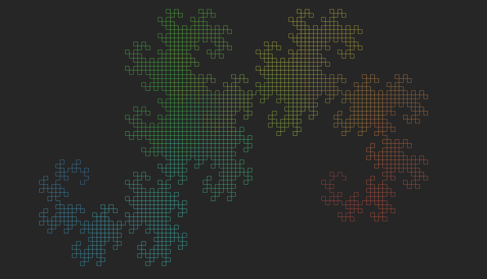

# **lsystem** - L-System Generator

**lsystem** is a hobby project that aims to create a unique and flexible interface for creating [Lindenmayer systems](https://en.wikipedia.org/wiki/L-system) (L-systems) using C++ and OpenGL. The purpose of this project is sharpen the programming skills of those involved and casually explore the visual beauty of L-systems.

## Getting Started

**lsystem** is currently being developed on a Linux environment. Compatibility with Windows and MacOS is currently untested. To build the project make sure you have the prerequisites listed below and simply run the [makefile](makefile) in the root directory. For usage details see [USEAGE.md](docs/USAGE.md).

### Prerequisites

To run this project you will need to have the following installed on your system:

* GCC 5
* OpenGL
* GLEW
* GLUT
* GLU

## Development Progress

For a general plan and progress journal for project features see [ROADMAP.md](docs/ROADMAP.md). For a full commit based changelog see [CHANGELOG.md](docs/CHANGELOG.md)

## Authors

The main authors of this repository are:

* [**Benjamin Lewis**](https://codefukurou.github.io) [[@codefukurou](https://www.github.com/codefukurou)] - *Initial work and concept* 

## Contributing 

Constructive contributions to the project are encouraged and welcomed from those willing to do so. I encourage anyone with questions or a willingness to help out to [contact the author](mailto:admin@lewisbj.com), I would be more than happy to have a chat.

## License

This project is licensed under the GNU General Public License - see the [LICENSE.md](LICENSE.md) file for details